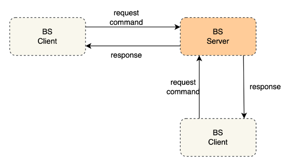
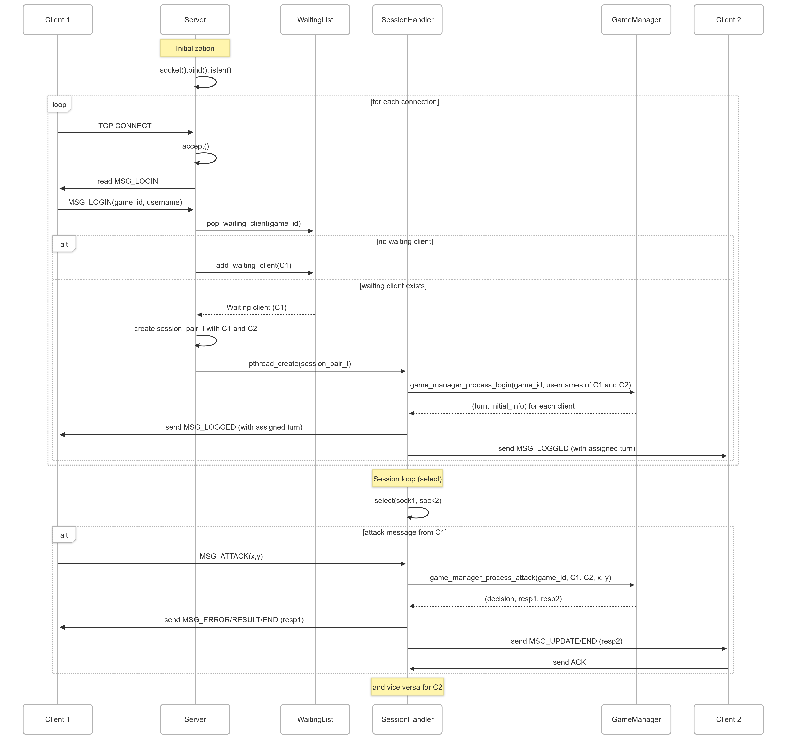

# Estructura del proyecto y ejecución

El proyecto está dividido en dos ramas principales

**main** - correspondiente al servidor

**client** - correspondiente al cliente

Al pulsar en la rama client, se podrá observar un README.MD cómo correr el cliente, que está implementado en python.

**Para correr el servidor**

Clonar el repositorio y ubicarse en la carpeta raiz.

```jsx
make -f build/Makefile
```

Lo siguiente creará dos ejecutables client (para debug) y server. Sin embargo, los ejecutables ya estarán por defecto en el repositorio.

De esa manera usted podrá ejecutar el servidor en sistemas Unix/Linux

```jsx
./server <ip> <port> </path/log.log>
```

Donde

- ip: es la dirección ip en la cual el servidor va a ejecutar las aplicaciones. 0.0.0.0 por defecto para la IP local o que se añada directamente a la IP configurada en AWS.
- port: es el puerto en el cual se escucharán las peticiones por parte de los clientes. 8080 por defecto es el recomendado.
- /path/log.log: representa la ruta y nombre del archivo que almacena el log. server.log en la carpeta raiz, puede poner la ruta que desee.

Estos parámetros son opcionales, si usted no los coloca se pondrán los que están por defecto.

### Estructura de archivos del proyecto
```jsx
└── Battleship-Networking
    ├── build
    │   └── Makefile
    ├── client debug
    ├── docs
    │   ├── images
    ├── include
    │   ├── game_manager.h
    │   ├── protocol.h
    │   ├── session_handler.h
    │   └── utils.h
    ├── README.md
    ├── server
    └── src
        ├── client.c
        ├── game_manager.c
        ├── protocol.c
        ├── server_main.c
        ├── session_handler.c
        └── utils.c
```

# Documentación

## Introducción.

El presente documento describe el desarrollo de **BattleShip**, el es una implementación en lenguaje C del clásico juego de batalla naval, diseñada como parte de un proyecto para el curso de **Telemática**. A través de este proyecto se busca aplicar y consolidar conocimientos fundamentales sobre **protocolos de comunicación**, **programación de sockets**, **modelos cliente-servidor** y **manejo de hilos (threads)**, utilizando la API de sockets de Berkeley.

El núcleo del proyecto gira en torno al diseño e implementación de un servidor de juego multicliente que permite a dos jugadores interactuar en tiempo real a través de una red, siguiendo una arquitectura basada en TCP. Para ello, se desarrolló un protocolo de comunicación propio que permite gestionar el intercambio de mensajes, validación de jugadas, sincronización de turnos y finalización de partidas, todo a través de conexiones persistentes utilizando sockets TCP.

El servidor ha sido desplegado utilizando Amazon Web Services (AWS), lo que permite a los clientes conectarse desde cualquier ubicación con acceso a internet, simulando un entorno de red distribuida y facilitando pruebas más cercanas a escenarios del mundo real.

Desde el lado del cliente, se implementó una interfaz por consola, funcional y clara, que permite a los jugadores visualizar sus tableros, ingresar coordenadas y recibir el estado actualizado del juego conforme a los mensajes enviados por el servidor. Aunque se mantiene un enfoque minimalista, la interfaz cumple con los requerimientos de usabilidad y dinámica del juego.

Técnicamente, el proyecto destaca por el uso de múltiples hilos en el servidor para manejar la concurrencia entre clientes, el manejo explícito de buffers, la conversión y validación de datos en red, así como la aplicación de conceptos como encapsulamiento de protocolos, control de errores, despliegue remoto y sincronización entre procesos.

Este trabajo busca no solo poner en práctica habilidades de programación en bajo nivel, sino también reforzar la comprensión de cómo funcionan las comunicaciones entre procesos distribuidos, la gestión de recursos compartidos y la construcción de aplicaciones robustas sobre redes IP en entornos reales de despliegue.

## Desarrollo.

### TCP vs UDP

Para el desarrollo lo primero que realizamos fue el análisis sobre cuál tipo de socket deberíamos utilizar. En este caso, decidimos utilizar TCP, ya que 

- **Es fiable:** TCP garantiza la entrega completa y en orden de los mensajes, lo que nos asegura la llegada correcta de los mensajes del protocolo y el orden de los turnos.
- **Controla  errores:** Detecta y corrige errores automáticamente durante la transmisión.
- **Es orientado a conexión:** Permite gestionar sesiones activas entre cliente y servidor, de manera sincronizada
- **Es más fácil de desarrollar:** Abstracciones de alto nivel simplifican la implementación y reducen errores.

Por otro lado UDP ni garantiza la entrega ni tiene un control de orden, lo que puede complicar la lógica de este juego por turnos.

### Servidor y concurrencia

Para el servidor hemos seguido la parte base del servidor TCP y los de los sockets descrita en https://www.geeksforgeeks.org/tcp-server-client-implementation-in-c/ 

Para la parte de concurrencia, hemos decidido utilizar hilos, guiandonos por la siguiente guía: https://www.cs.cmu.edu/afs/cs/academic/class/15492-f07/www/pthreads.html

El planteamiento que utilizamos, de manera simplificada, es el siguiente: 

- El servidor (server_main.c) hace bind a los sockets y empieza a escuchar las conexiones, va aceptando los clientes.
- Una vez llegados los clientes, empareja clientes respecto al número de la sesión, allí crea una sesión para ambos, y asigna esta sesión a un hilo. (session_handler.c)
- Hay funciones que manejan estructuras de datos para establecer y liberar las ID de las diferentes sesiones conforme se conectan y se ponen en espera los diferentes clientes
- Luego dentro de cada hilo (sesión) usamos `select()` sobre un fd_set que contiene ambos sockets, para multiplexar I/O sobre los dos sockets. De modo que un solo hilo gestione ambos clientes de forma concurrente, este administrará el intercambio de mensajes entre esos dos clientes (protocol.c) e invocará a la lógica de juego (game_manager.c).
- Finalmente, se llama a `pthread_detach()` para que el hilo libere sus recursos automáticamente al terminar.

De este modo es escalable (porque cada sesión corre su propio hilo y aisla su lógica del juego de las demás), eficiente y modular(ya que separamos la lógica, el servidor y las sesiones, aprovechando el protocolo).


**Diagramas de arquitectura.**

Arquitectura General



**Arquitectura planteada para nuestro proyecto**


Diagrama de “clases”


### Protocolo

Explicación del flujo general planteado:

En un principio, luego de estar en la sesión, es decir de haber sido emparejados por el servidor y asignados a un hilo, los clientes enviarán un mensaje de LOGIN, el servidor responderá con un LOGGED que tendrá la información de la board generada aleatoriamente. Además, el loged tendrá un 0 o un 1 que representará el estado del turno del cliente (por defecto 0), así, el cliente administrará los turnos, si le llega 1, puede atacar. Cuando el cliente con el turno 1 en LOGGED ataca, se envía el mensaje ATTACK, este llega a la sesión, se evalúa en el game_manager, se actualiza la tabla y se manda un decisión, esta decisión definirá la respuesta de la sesión. En caso de que el ataque sea válido, se enviará un RESULT (que servirá a la vez como un ack por parte del servidor) seteando su turno en 0 para el atacante y un UPDATE para el atacado, seteando su turno en 1. El que recibe el UPDATE envía un ACK al servidor para saber que todo salió bien. Ahora es turno del otro cliente y se seguirá el mismo flujo.

La sesión tiene implementado que, si no se reciben respuestas durante 30 segundos enviará un mensaje de TIMEOUT|MatchID|-1, negando los turnos de ambos clientes. De esa manera, los clientes son los responsables de administrar los turnos y la limitación de mensajes bloqueando los input, mientras que el servidor se encarga de los errores, de administrar la lógica de turnos general y de registrar la información de las tablas y barcos.

**Los mensajes definidos para el protocolo**

**Cliente**

| Mensaje | DATOS                   | Dirigido a |
|---------|-------------------------|------------|
| LOGIN   | \|MatchID\|username     | Server     |
| ATTACK  | \|MatchID\|x,y          | Server     |
| FF      | \|MatchID\|username     | Server     |
| ACK     | \|MatchID\|1            | Server     |

---

**Servidor**

| Mensaje   | Datos                                         | Dirigido a       | Descripción                                                                           |
|-----------|-----------------------------------------------|------------------|---------------------------------------------------------------------------------------|
| LOGGED    | \|MatchID\|OK/NO\|turn\|InitialInfo(board)    | Cliente          | Se envía la información del tablero.                                                  |
| RESULT    | \|MatchID\|HIT/NOHIT\|turn=0                  | Cliente Atacante | Se envía al atacante para actualizar si dio o falló.                                  |
| UPDATE    | \|MatchID\|HIT/NOHIT\|x,y\|turn=1             | Cliente Atacado  | Se envía al atacado para actualizar su turno y su estado del tablero.                |
| TIMEOUT   | \|MatchID\|-1                                 | Ambos Clientes   | Se envía cuando pasan 30 segundos. Se cambia el turno.                                |
| GAME_END  | \|MatchID\|HIT/NOHIT\|x,y/FF\|winner_username | Ambos Clientes   | Se envía a ambos cuando se recibe FF. Termina el juego.                               |

---

**Errores (Servidor)**

| Mensaje | Datos       | Dirigido a       | Descripción                                |
|---------|-------------|------------------|--------------------------------------------|
| ERROR   | DA          | Cliente atacante | Ataque duplicado.                          |
| ERROR   | OOB         | Cliente atacante | Fuera de casillas.                         |
| ERROR   | NoBoard     | Cliente atacante | Debug frente a concurrencia (sin tablero). |


**Diagrama de secuencia basado en el código.**



**Diagramas por casos del protocolo**

Caso inicial 


Caso de ataque por parte de un cliente


Caso de error en el ataque


Caso de TIMEOUT (el tiempo de 30 segundos se ha agotado)


Caso GAME_END por barcos destruidos


Caso GAME_END por forfeit


## Aspectos Logrados y No logrados.

Se cumplió con cada una de las funcionalidades que, según el enunciado, tanto servidor como cliente debían implementar:

1. Se aceptan distintas conexiones de manera simultánea. **Utilizamos la estrategia de hilos posix por sesión.**
2. Emparejamos jugadores de acuerdo **al matchID seleccionado por los usuarios.**
3. Mantenemos el estado del juego en el hilo de cada sesión gracias al módulo **game_manager**
4. Validamos las acciones según las reglas, **definiendo errores en el game_manager y el mensajes en el protocolo.**
5. Notificamos a los clientes  de la información del juego gracia**s a los mensajes RESULT y UPDATE y su respectiva información: HIT o NOHIT + coordenadas**. Desde el cliente esto se **muestra de manera intuitiva con la impresión de ambos tableros**.
6. Gestionamos turnos a través de los mensajes RESULT y UPDATE, con su dato de turn (binario)
7. Detectamos y gestionamos desconexiones, el juego se puede acabar con FF, al realizarse una desconexión forzada **se cierra le sesión y se informa tanto al servidor como al cliente paritario.**
8. Registramos los logs, además de que el cliente puede ver su historial de movimientos ya que todo queda impreso en consola.
9. **Implementamos el temporizador con el mensaje TIMEOUT**
10. Finalizamos partidas con la condición de victoria de undir cada punto de todos los barcos o rendición(FF): GAME_END

Aspectos a mejorar / no logrados

- Hay ciertos bugs visuales que se dan en el cliente por el manejo de threads en el input_handler.
- En la interfaz de usuario no hay un contador a tiempo real, sin embargo, se le informa al usuario cuando es su turno que tiene 30 segundos.

## Conclusiones.

**Profundización en el modelo cliente‑servidor y TCP.**

Implementar un servidor basado en sockets de Berkeley y un protocolo propio de mensajería ha permitido comprender a fondo cómo TCP garantiza la entrega fiable y en orden de los datos, así como las implicaciones de diseñar un protocolo de aplicación que gestione turnos, errores y finalización de sesión.

**Diseño de un protocolo de juego robusto.**

Definir mensajes claros (LOGIN, LOGGED, ATTACK, RESULT, UPDATE, TIMEOUT, GAME_END, ERROR) y flujos de comunicación con acuses de recibo y temporizadores de inactividad ha reforzado la comprensión de encapsulamiento de datos, control de errores y sincronización entre procesos distribuidos.

**Despliegue en entorno real (AWS).**

Hospedar el servidor en la nube ha aportado experiencia en la configuración de redes públicas, manejo de direcciones IP y puertos, así como la importancia de la monitorización y el registro de logs en producción.

**Manejo de concurrencia con POSIX threads.**

La creación de un hilo por sesión de dos jugadores demuestra cómo la programación multihilo facilita la escalabilidad y el aislamiento de la lógica de cada partida. 

**Experiencia práctica con programación de sockets en C y Python.**

El contraste entre la implementación del cliente en Python (por su agilidad y facilidad de desarrollo) y el servidor en C (por su eficiencia y control de bajo nivel) aporta una gran experiencia en el ámbito real y la dificultad que tiene un proyecto con múltiples requerimientos, algo a lo que no estábamos acostumbrados.

## Referencias.

- [TCP Server-Client Implementation in C](https://www.geeksforgeeks.org/tcp-server-client-implementation-in-c/)
- [POSIX Threads Programming Guide](https://www.cs.cmu.edu/afs/cs/academic/class/15492-f07/www/pthreads.html)
- [Socket Programming in C/C++](https://www.geeksforgeeks.org/socket-programming-cc/)
- [Linux Socket Programming Tutorial](https://www.linuxhowtos.org/C_C++/socket.htm)
- [Python Socket Programming Guide](https://realpython.com/python-sockets/)
- [TCP vs UDP: Key Differences](https://www.geeksforgeeks.org/differences-between-tcp-and-udp/)
